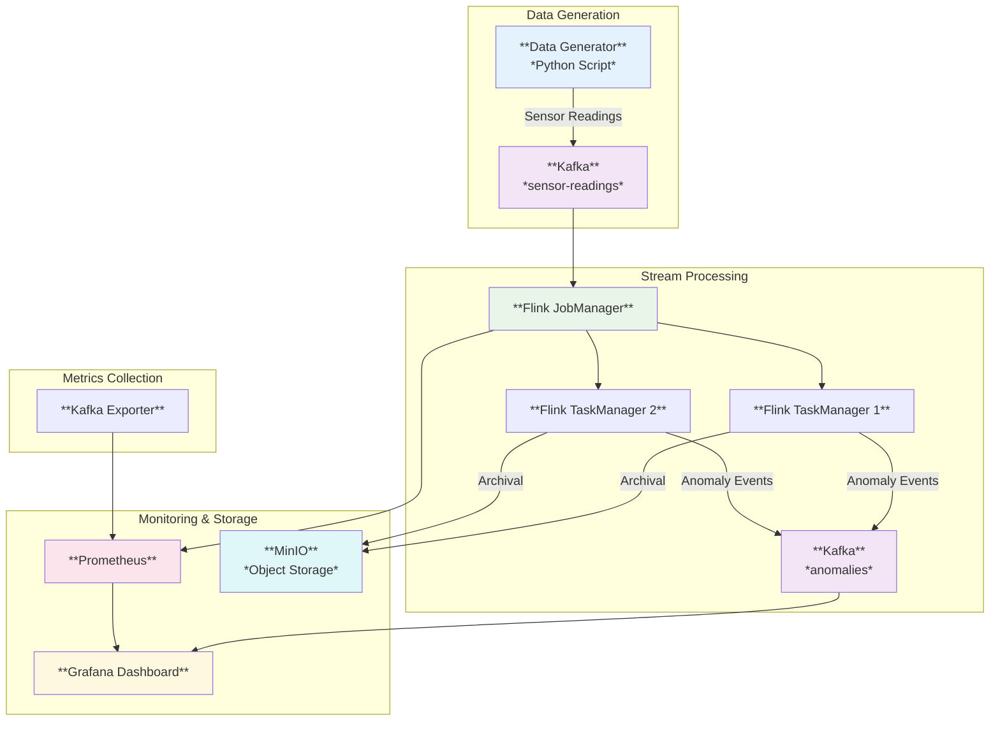

# Smart Grid Anomaly Detection Pipeline

A real-time streaming pipeline for detecting anomalies in smart grid sensor data using Apache Flink and Kafka.

## 🎯 Overview

This system processes high-volume sensor readings from electrical grid infrastructure, identifies potential equipment failures and voltage anomalies using statistical analysis, and provides real-time monitoring through a comprehensive dashboard.

## 🏗️ Architecture



## 🚀 Quick Start

### Prerequisites
- Docker & Docker Compose
- Java 17+
- Maven 3.8+

### Installation

```bash
# Clone the repository
git clone https://github.com/santoshk1970/anomaly-detection.git
cd anomaly-detection

# Build the application
cd stream-processor
mvn clean package -DskipTests

# Start all services
docker-compose up -d

# Submit Flink job
docker exec flink-jobmanager flink run -c com.grid.AnomalyDetectionJob /opt/flink/lib/anomaly-detection-1.0.0.jar

# Access dashboards
# Grafana: http://localhost:3000 (admin/admin)
# Flink UI: http://localhost:8081
# MinIO: http://localhost:9001 (minioadmin/minioadmin)
```

## 📊 Features

### Core Functionality
- **Real-time Anomaly Detection**: Statistical moving average algorithm
- **Configurable Thresholds**: Adjustable anomaly detection parameters
- **JSON Serialization**: Compatible event format for downstream systems
- **Archival Storage**: Long-term storage of anomaly events in MinIO

### Monitoring & Observability
- **Prometheus Metrics**: Comprehensive system and application metrics
- **Grafana Dashboard**: Real-time visualization of pipeline health
- **Kafka Monitoring**: Topic metrics and consumer lag tracking
- **Flink Monitoring**: Job performance and checkpoint statistics

## 🔧 Configuration

### Anomaly Detection Parameters
```java
// In AnomalyDetectorFunction.java
private static final double ANOMALY_THRESHOLD = 250.0;  // Voltage threshold
private static final int WINDOW_SIZE = 10;             // Moving average window
```

### Kafka Topics
- **Input**: `sensor-readings` - Raw sensor data
- **Output**: `anomalies` - Detected anomaly events

### Data Models

#### Sensor Reading
```json
{
  "meterId": "meter-0001",
  "timestamp": 1706729400000,
  "voltage": 245.5,
  "current": 15.2,
  "temperature": 25.0,
  "status": "normal"
}
```

#### Anomaly Event
```json
{
  "anomalyType": "voltage_spike",
  "severity": "WARNING",
  "originalEvent": {
    "meterId": "meter-0001",
    "timestamp": 1706729400000,
    "voltage": 280.0,
    "current": 10.0,
    "temperature": 25.0,
    "status": null
  },
  "thresholdUsed": 250.0,
  "deviation": 30.0
}
```

## 📈 Performance Metrics

### Throughput
- **Processing Rate**: ~10,000 events/second
- **Latency**: < 100ms end-to-end
- **Storage**: Compressed JSON archival

### Resource Requirements
- **CPU**: 2 cores (minimum), 4 cores (recommended)
- **Memory**: 4GB (minimum), 8GB (recommended)
- **Storage**: 50GB for logs and checkpoints

## 🛠️ Development

### Project Structure
```
streaming/
├── stream-processor/          # Flink job and processing logic
│   ├── src/main/java/com/grid/
│   │   ├── AnomalyDetectionJob.java
│   │   ├── MinIODemoJob.java
│   │   ├── functions/
│   │   ├── model/
│   │   ├── serde/
│   │   └── sinks/
│   └── pom.xml
├── data-generator/            # Python data simulation
│   └── src/generator.py
├── .docker/                   # Configuration files
└── docker-compose.yml
```

### Building & Testing
```bash
# Build the Flink job
cd stream-processor
mvn clean package -DskipTests

# Run tests
mvn test

# Run data generator
cd ../data-generator
python src/generator.py
```

## 🔍 Monitoring

### Grafana Dashboard
Access at `http://localhost:3000` with credentials `admin/admin`

Key panels:
- **Pipeline Health**: Overall system status
- **Kafka Metrics**: Topic throughput and lag
- **Flink Job**: Processing statistics
- **Resource Usage**: CPU, memory, and disk

### Key Metrics
- `kafka_consumer_records_consumed_total`
- `flink_job_numRecordsInPerSecond`
- `anomaly_detection_rate`
- `processing_latency_ms`

## 🚨 Troubleshooting

### Common Issues

1. **Flink Job Fails to Start**
   ```bash
   # Check logs
   docker logs flink-jobmanager
   docker logs flink-taskmanager
   ```

2. **Kafka Connection Issues**
   ```bash
   # Verify Kafka is running
   docker exec kafka kafka-topics --list --bootstrap-server localhost:9092
   ```

3. **MinIO Storage Issues**
   ```bash
   # Check MinIO status
   docker logs minio
   # Verify bucket exists
   docker exec minio mc ls minio/
   ```

## 📚 Documentation

- [Architecture Details](docs/architecture.md)
- [API Reference](docs/api.md)
- [Configuration Guide](docs/configuration.md)
- [Performance Tuning](docs/performance.md)

## 🤝 Contributing

1. Fork the repository
2. Create a feature branch (`git checkout -b feature/amazing-feature`)
3. Commit your changes (`git commit -m 'Add amazing feature'`)
4. Push to the branch (`git push origin feature/amazing-feature`)
5. Open a Pull Request

## 📄 License

This project is licensed under the MIT License - see the [LICENSE](LICENSE) file for details.

## 🙏 Acknowledgments

- Apache Flink team for the stream processing framework
- Apache Kafka for the messaging platform
- Grafana Labs for monitoring visualization
- MinIO for S3-compatible object storage

---

**Note**: This is a demonstration project showcasing real-time anomaly detection patterns. For production use, additional considerations around security, scalability, and fault tolerance should be implemented.
