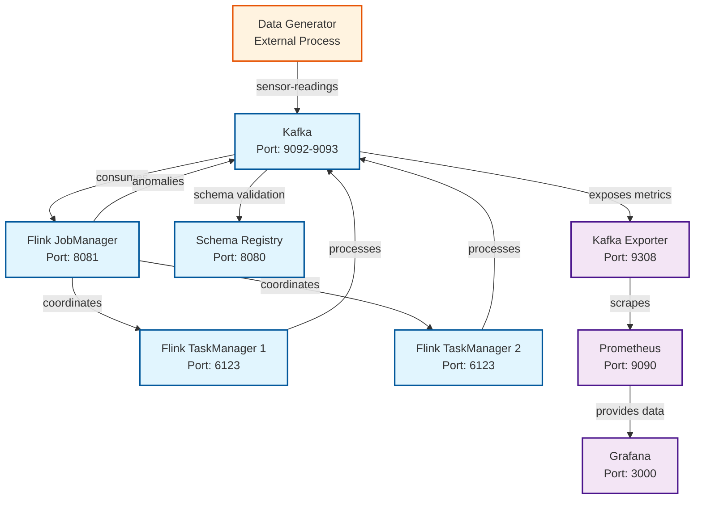
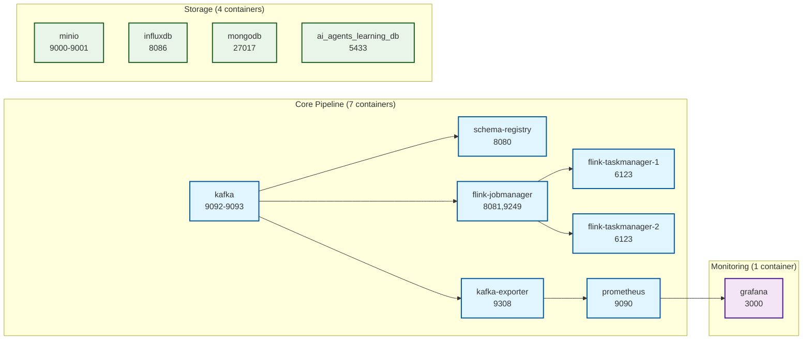
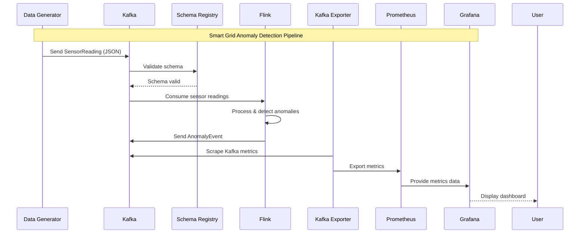
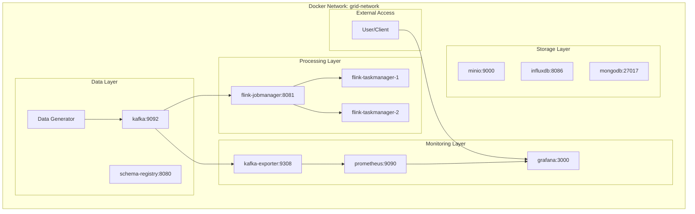
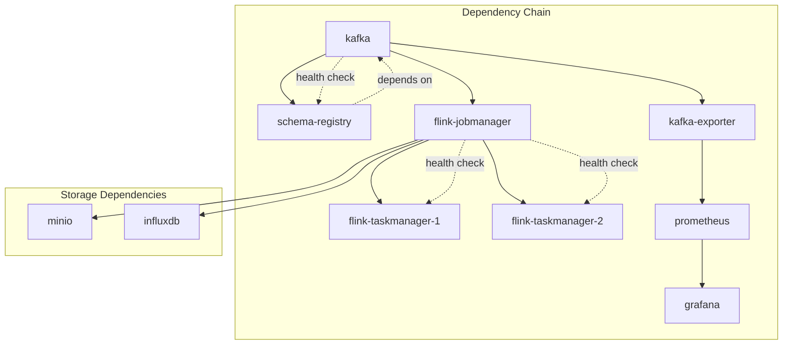

# Smart Grid Anomaly Detection Pipeline Architecture

## Core Pipeline Architecture

```mermaid
graph TB
    %% External Data Source
    DG[Data Generator<br/>External Process] --> |sensor-readings| K[Kafka<br/>Port: 9092-9093]
    
    %% Core Streaming Components
    K --> |consumes| FJ[Flink JobManager<br/>Port: 8081]
    K --> |schema validation| SR[Schema Registry<br/>Port: 8080]
    
    %% Flink Cluster
    FJ --> |coordinates| FT1[Flink TaskManager 1<br/>Port: 6123]
    FJ --> |coordinates| FT2[Flink TaskManager 2<br/>Port: 6123]
    
    %% Metrics Collection
    K --> |exposes metrics| KE[Kafka Exporter<br/>Port: 9308]
    KE --> |scrapes| P[Prometheus<br/>Port: 9090]
    
    %% Visualization
    P --> |provides data| G[Grafana<br/>Port: 3000]
    
    %% Data Flow
    FT1 --> |processes| K
    FT2 --> |processes| K
    FJ --> |anomalies| K
    
    %% Styling
    classDef core fill:#e1f5fe,stroke:#01579b,stroke-width:2px
    classDef monitoring fill:#f3e5f5,stroke:#4a148c,stroke-width:2px
    classDef storage fill:#e8f5e8,stroke:#1b5e20,stroke-width:2px
    classDef external fill:#fff3e0,stroke:#e65100,stroke-width:2px
    
    class DG external
    class K,FJ,FT1,FT2,SR core
    class KE,P,G monitoring
```

## Container Overview

```mermaid
graph LR
    subgraph "Core Pipeline (7 containers)"
        K1[kafka<br/>9092-9093]
        SR1[schema-registry<br/>8080]
        FJ1[flink-jobmanager<br/>8081,9249]
        FT1[flink-taskmanager-1<br/>6123]
        FT2[flink-taskmanager-2<br/>6123]
        KE1[kafka-exporter<br/>9308]
        P1[prometheus<br/>9090]
    end
    
    subgraph "Monitoring (1 container)"
        G1[grafana<br/>3000]
    end
    
    subgraph "Storage (4 containers)"
        M1[minio<br/>9000-9001]
        I1[influxdb<br/>8086]
        M2[mongodb<br/>27017]
        P2[ai_agents_learning_db<br/>5433]
    end
    
    %% Connections
    P1 --> G1
    KE1 --> P1
    K1 --> SR1
    K1 --> KE1
    K1 --> FJ1
    FJ1 --> FT1
    FJ1 --> FT2
    
    %% Styling
    classDef core fill:#e1f5fe,stroke:#01579b,stroke-width:2px
    classDef monitoring fill:#f3e5f5,stroke:#4a148c,stroke-width:2px
    classDef storage fill:#e8f5e8,stroke:#1b5e20,stroke-width:2px
    
    class K1,SR1,FJ1,FT1,FT2,KE1,P1 core
    class G1 monitoring
    class M1,I1,M2,P2 storage
```

## Data Flow Sequence

```mermaid
sequenceDiagram
    participant DG as Data Generator
    participant K as Kafka
    participant SR as Schema Registry
    participant F as Flink
    participant KE as Kafka Exporter
    participant P as Prometheus
    participant G as Grafana
    
    Note over DG,G: Smart Grid Anomaly Detection Pipeline
    
    DG->>K: Send SensorReading (JSON)
    K->>SR: Validate schema
    SR-->>K: Schema valid
    K->>F: Consume sensor readings
    F->>F: Process & detect anomalies
    F->>K: Send AnomalyEvent
    KE->>K: Scrape Kafka metrics
    KE->>P: Export metrics
    P->>G: Provide metrics data
    G-->>User: Display dashboard
```

## Network Topology

```mermaid
graph TB
    subgraph "Docker Network: grid-network"
        subgraph "External Access"
            USER[User/Client]
        end
        
        subgraph "Data Layer"
            DG[Data Generator]
            K[kafka:9092]
            SR[schema-registry:8080]
        end
        
        subgraph "Processing Layer"
            FJ[flink-jobmanager:8081]
            FT1[flink-taskmanager-1]
            FT2[flink-taskmanager-2]
        end
        
        subgraph "Monitoring Layer"
            KE[kafka-exporter:9308]
            P[prometheus:9090]
            G[grafana:3000]
        end
        
        subgraph "Storage Layer"
            MINIO[minio:9000]
            INFLUX[influxdb:8086]
            MONGO[mongodb:27017]
        end
    end
    
    USER --> G
    DG --> K
    K --> FJ
    FJ --> FT1
    FJ --> FT2
    K --> KE
    KE --> P
    P --> G
```

## Service Dependencies

```mermaid
graph TD
    subgraph "Dependency Chain"
        K[kafka] --> SR[schema-registry]
        K --> FJ[flink-jobmanager]
        FJ --> FT1[flink-taskmanager-1]
        FJ --> FT2[flink-taskmanager-2]
        K --> KE[kafka-exporter]
        KE --> P[prometheus]
        P --> G[grafana]
    end
    
    subgraph "Storage Dependencies"
        FJ --> MINIO[minio]
        FJ --> INFLUX[influxdb]
    end
    
    %% Health checks
    K -.-> |health check| SR
    SR -.-> |depends on| K
    FJ -.-> |health check| FT1
    FJ -.-> |health check| FT2
```
