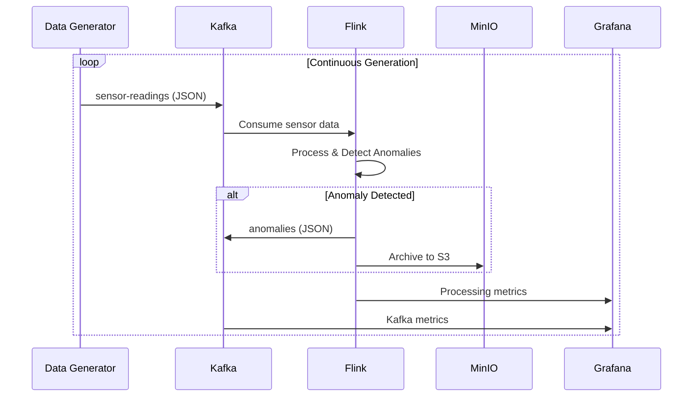

# Architecture Documentation

## System Overview

The Smart Grid Anomaly Detection Pipeline is a distributed streaming system designed to process real-time sensor data from electrical grid infrastructure and detect potential equipment failures or voltage anomalies.

## Core Components

### 1. Data Generation Layer
- **Python Data Generator**: Simulates smart grid sensor readings
- **Configurable Anomaly Rates**: Adjustable probability of anomaly injection
- **Realistic Data Patterns**: Mimics actual grid sensor behavior

### 2. Message Streaming Layer
- **Apache Kafka**: High-throughput message broker
- **Topics**:
  - `sensor-readings`: Raw sensor data input
  - `anomalies`: Processed anomaly events output
- **Partitioning**: By meter ID for parallel processing
- **Retention**: Configurable based on storage requirements

### 3. Stream Processing Layer
- **Apache Flink**: Distributed stream processing engine
- **JobManager**: Coordinates job execution
- **TaskManagers**: Execute parallel processing tasks
- **Checkpointing**: Exactly-once processing guarantees
- **State Management**: Maintains moving averages per meter

### 4. Storage Layer
- **MinIO**: S3-compatible object storage
- **File Organization**: Date-based bucket structure
- **Format**: JSON serialized anomaly events
- **Retention Policy**: Long-term archival of detected anomalies

### 5. Monitoring Layer
- **Prometheus**: Time-series metrics collection
- **Grafana**: Visualization and alerting
- **Kafka Exporter**: Kafka-specific metrics
- **Flink Metrics**: Job performance indicators

## Data Flow



## Processing Logic

### Anomaly Detection Algorithm
1. **Moving Average Calculation**: Maintain sliding window of N readings
2. **Threshold Comparison**: Current reading vs. average + threshold
3. **Anomaly Classification**: Type and severity determination
4. **Event Generation**: Structured anomaly event creation

### State Management
- **Keyed State**: Per-meter moving averages
- **Checkpointing**: Periodic state persistence
- **Recovery**: Automatic state restoration on failure

## Scalability Considerations

### Horizontal Scaling
- **Kafka Partitions**: Parallel data distribution
- **Flink Parallelism**: Configurable task parallelism
- **Container Orchestration**: Docker Compose scaling

### Performance Optimization
- **Batch Processing**: Configurable micro-batching
- **Compression**: Snappy compression for storage
- **Memory Management**: Tuned heap sizes for containers

## Fault Tolerance

### Kafka
- **Replication Factor**: Configurable topic replication
- **Leader Election**: Automatic failover
- **Consumer Groups**: Load balancing and recovery

### Flink
- **Checkpointing**: Exactly-once processing
- **Savepoints**: Manual job state snapshots
- **Restart Strategies**: Configurable failure handling

### MinIO
- **Erasure Coding**: Data protection
- **Versioning**: Object version control
- **Access Control**: IAM policies

## Security Considerations

### Network Security
- **Internal Networks**: Docker network isolation
- **Port Exposure**: Minimal external ports
- **TLS**: Encrypted communication where applicable

### Data Security
- **Access Control**: MinIO bucket policies
- **Authentication**: Basic auth for services
- **Audit Logging**: Access and operation logging

## Deployment Architecture

### Container Orchestration
```yaml
# Key services in docker-compose.yml
services:
  zookeeper:        # Kafka coordination
  kafka:           # Message broker
  flink-jobmanager: # Flink coordination
  flink-taskmanager: # Flink processing
  minio:           # Object storage
  prometheus:      # Metrics collection
  grafana:         # Visualization
  kafka-exporter:  # Kafka metrics
```

### Resource Allocation
- **CPU**: 2-4 cores per service
- **Memory**: 4-8GB per service
- **Storage**: 50GB+ for logs and data
- **Network**: Internal Docker network

## Monitoring & Observability

### Key Metrics
- **Throughput**: Events processed per second
- **Latency**: End-to-end processing time
- **Error Rate**: Failed processing attempts
- **Resource Usage**: CPU, memory, disk utilization

### Alerting
- **Pipeline Health**: Overall system status
- **Anomaly Rate**: Spike in anomaly detection
- **Resource Limits**: Memory/CPU thresholds
- **Storage**: Disk space warnings

## Future Enhancements

### Technical Improvements
1. **Machine Learning**: Advanced anomaly detection algorithms
2. **Stream-SQL**: Flink SQL for complex queries
3. **Event Sourcing**: Complete event history
4. **CQRS**: Read/write separation

### Operational Improvements
1. **Kubernetes**: Container orchestration
2. **CI/CD**: Automated deployment pipelines
3. **Security**: RBAC and network policies
4. **Multi-region**: Geographic distribution

### Business Features
1. **Alerting**: Real-time notifications
2. **Reporting**: Historical analysis
3. **API**: RESTful service endpoints
4. **UI**: Web-based management interface
